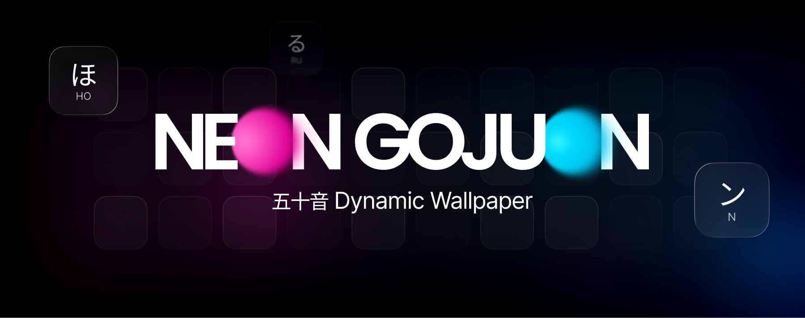

# Neon Gojuon Wallpaper | 霓虹五十音动态壁纸

  
    

> **A stylish, cyberpunk-inspired interactive Japanese 50-sound table designed for your desktop.**
>
> **专为桌面设计的赛博朋克风格交互式日语五十音动态壁纸。**

---

## 🎨 Introduction / 简介

**Neon Gojuon Wallpaper** transforms your desktop into a futuristic learning tool. It features a glowing grid of Japanese Kana that reacts to your mouse cursor. It's not just a wallpaper; it's a fully interactive web application that helps you memorize Hiragana and Katakana through visual immersion.

**Neon Gojuon Wallpaper** 将您的桌面变成一个未来感十足的学习工具。它展示了一个随着鼠标移动而发光的日语假名网格。这不仅是一张壁纸，更是一个完全交互式的 Web 应用程序，通过沉浸式的视觉体验帮助您记忆平假名和片假名。

 

## ✨ Features / 功能特性

*   **Cyberpunk Aesthetic**
     Dark mode with neon blue and pink accents, featuring high-quality glassmorphism effects.
     **赛博朋克美学**：深色模式搭配霓虹蓝粉配色，拥有高质量的毛玻璃特效。

*   **Interactive Grid**
     Cells light up and track your mouse movement with a smooth glow effect.
     **交互式网格**：单元格随鼠标移动点亮，并具有流畅的光标跟随发光效果。

*   **Study Modes**
     Switch between Hiragana, Katakana, or display both simultaneously via the top bar.
     **学习模式**：通过顶部工具栏，支持在平假名、片假名或两者同时显示之间自由切换。

*   **Vocabulary Card**
     Click any character to open a detailed view featuring Romaji, stroke readings, and vocabulary.
     **单词卡片**：点击任意假名即可打开详情页，包含罗马音、读音以及随机的单词例句。

*   **Customizable Settings**
     Adjust grid size, spacing, and particle effects via the floating settings panel.
     **个性化设置**：通过悬浮面板调整网格大小、间距和粒子特效。

*   **Offline & Lightweight**
     Runs entirely locally. No API keys or internet connection required.
     **离线轻量**：完全本地运行，内置数据库，无需联网。

 

## 📦 Prerequisites / 前置需求

To use this as a live wallpaper on Windows, you need the **Lively Wallpaper** software.
要将其作为 Windows 动态壁纸使用，您需要安装 **Lively Wallpaper** 软件。

👉 **[Download Lively Wallpaper (GitHub)](https://github.com/rocksdanister/lively)**

 

## 🚀 Installation / 安装步骤

1.  **Install Lively Wallpaper** from the link above.
     从上方链接下载并安装 Lively Wallpaper。

2.  **Download this project** (Clone the repo or download the ZIP).
     下载本项目（克隆仓库或下载 ZIP 压缩包）。

3.  **Open Lively Wallpaper** and go to the "**Add Wallpaper**" screen (Plus icon).
     打开 Lively Wallpaper，点击“添加壁纸”按钮（加号图标）。

4.  **Drag and drop** the `index.html` file (or the folder containing it) into the Lively window.
     将 `index.html` 文件（或包含该文件的文件夹）直接拖入 Lively 窗口中。

5.  **Done!** Enjoy your new interactive desktop.
     **完成！** 享受您的全新交互式桌面。

 

## 🛠 Tech Stack / 技术栈

*   **HTML5 & CSS3:** CSS Variables, Flexbox/Grid, Backdrop Filter.
*   **JavaScript (ES6+):** Vanilla JS for logic, DOM manipulation, and state management.
*   **Fonts:** Noto Sans JP & JetBrains Mono.

 

## 📄 License / 许可证

This project is licensed under the MIT License.
本项目基于 MIT 许可证开源。

---

  <i>Created by <a href="https://github.com/ihonru">@honru</a></i>

