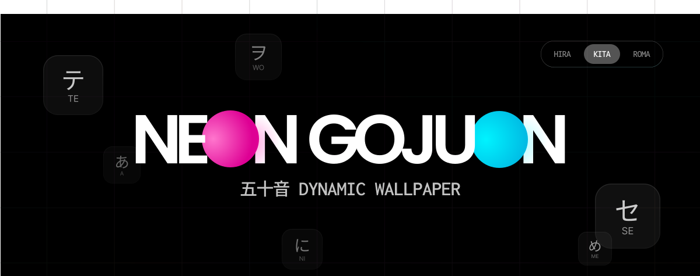

# Neon Gojuon Wallpaper | 霓虹五十音动态壁纸

**A stylish, cyberpunk-inspired interactive Japanese 50-sound table (Gojuon) designed for Lively Wallpaper.**
**专为 Lively Wallpaper 设计的赛博朋克风格交互式日语五十音动态壁纸。**

 

## 📖 Introduction / 简介

**Neon Gojuon Wallpaper** transforms your desktop into a futuristic learning tool. It features a glowing grid of Japanese Kana that reacts to your mouse cursor. It's not just a wallpaper; it's a fully interactive web application that helps you memorize Hiragana and Katakana through visual immersion.

**Neon Gojuon Wallpaper** 将您的桌面变成一个未来感十足的学习工具。它展示了一个随着鼠标移动而发光的日语假名网格。这不仅是一张壁纸，更是一个完全交互式的 Web 应用程序，通过沉浸式的视觉体验帮助您记忆平假名和片假名。

## ✨ Features / 功能特性

*   **Cyberpunk Aesthetic:** Dark mode with neon blue and pink accents, featuring high-quality glassmorphism effects.
    *   **赛博朋克美学：** 深色模式搭配霓虹蓝粉配色，拥有高质量的毛玻璃（Glassmorphism）特效。
*   **Interactive Grid:** Cells light up and track your mouse movement with a smooth glow effect.
    *   **交互式网格：** 单元格随鼠标移动点亮，并具有流畅的光标跟随发光效果。
*   **Study Modes:** Switch between Hiragana, Katakana, or display both simultaneously.
    *   **学习模式：** 支持在平假名、片假名或两者同时显示之间自由切换。
*   **Vocabulary Card:** Click any character to open a detailed view featuring Romaji, stroke readings, and random vocabulary examples with sentences.
    *   **单词卡片：** 点击任意假名即可打开详情页，包含罗马音、读音以及随机的单词例句。
*   **Offline & Lightweight:** Runs entirely locally using a built-in vocabulary database. No API keys or internet connection required.
    *   **离线轻量：** 完全本地运行，内置词汇数据库。无需 API 密钥或互联网连接。
*   **Vocabulary Refresh:** Click the refresh button on the detail card to cycle through different example words.
    *   **词汇刷新：** 点击详情卡片上的刷新按钮，可切换查看不同的例词。

## 🚀 How to Use / 使用方法

### For Lively Wallpaper (Recommended)
1.  Download the repository (or just the `index.html` file).
2.  Open **Lively Wallpaper**.
3.  Drag and drop the `index.html` file (or the folder containing it) into the Lively library window.
4.  Enjoy your new desktop!

### 适用于 Lively Wallpaper (推荐)
1.  下载本项目仓库（或仅下载 `index.html` 文件）。
2.  打开 **Lively Wallpaper** 软件。
3.  将 `index.html` 文件（或包含该文件的文件夹）拖入 Lively 的库窗口中。
4.  享受您的新桌面！

### As a Web Page / 作为网页使用
Simply open `index.html` in any modern web browser to view and interact with the project.
直接在任意现代浏览器中打开 `index.html` 即可预览和交互。

## 🛠 Tech Stack / 技术栈

*   **HTML5 & CSS3:** CSS Variables, Flexbox/Grid, Backdrop Filter.
*   **JavaScript (ES6+):** Vanilla JS for logic, DOM manipulation, and state management.
*   **Fonts:** Noto Sans JP & JetBrains Mono.

## 📄 License / 许可证

This project is licensed under the MIT License.
本项目基于 MIT 许可证开源。

---

*Created by [@honru](https://github.com/ihonru)*